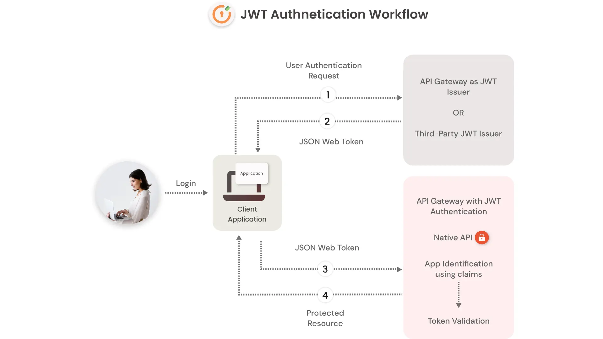

# NEXTjwtAuth (JWT based)

### - Framework Used : React(next.js 14.0.4)

Frontend part of implementation of JWT Authentication and Authorization.

### This project is designed to use with [@tirtharajsinha/django-auth](https://github.com/tirtharajsinha/django-auth).

It can be also used with other authservers with same api end points as [@tirtharajsinha/django-auth](https://github.com/tirtharajsinha/django-auth).

## Install dependencies

```
npm install
```

## Start application on development environment

- Start the backend authentication app ([@tirtharajsinha/django-auth](https://github.com/tirtharajsinha/django-auth)).

- Get the base url path of the backend app. (i.e http://127.0.0.1:8000)

- update the url in `NEXT_PUBLIC_AUTH_SERVER_URL` of `.env` file of this project.

- now start this application with

```
npm run dev
```

## build as react application

```
npm run build
```

it will create build in `/out` directory.
to test build open the `/out/index.html` on liveserver.


